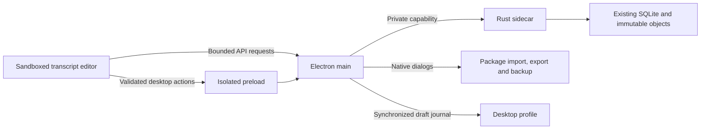

# Electron desktop migration

The Windows desktop preview adds native ownership of the existing Rust corpus
authority and TypeScript transcript editor. The migration starts from main
`a33f4d6` (PRs 1–11); the immutable published `v0.2.0-dev.11` preview is retained.
There is no new corpus schema, destructive conversion or parallel authoring store.

## Run and build

The local portable Windows package runs by opening `Open-K-Folds Workbench.exe`.
Keep the complete package folder together. No server, Python, Docker, Node or
Rust installation is required to run the package. This preview is unsigned.

For source development, install the existing Rust/MSVC and Node toolchains, then:

```powershell
npm ci
npm ci --prefix ui
npm run build:desktop
npm run desktop
npm run test:desktop
npm run package:windows
npm run test:electron
```

`WB_CARGO` can name a Cargo executable; `CARGO_TARGET_DIR` is respected. The build
creates a release sidecar, a compiled UI and a generated eight-second synthetic
practice recording. Packaging is local; it never uploads files or signs up for
a signing service. The output is under `release/desktop/`.

To build a separate review package while keeping a running preview intact, use:

```powershell
npm run package:windows -- --out release/desktop-review
```

The alternate output must stay beneath this checkout's `release/` folder.
Packaging rejects linked output directories and paths outside that folder before
replacing a build. Keep the running preview in `release/desktop/` and launch the
review build from `release/desktop-review/` with a separate QA profile.

## Desktop workflows

First launch offers **Import TEITOK package**, **Open existing workbench** and
**Try a synthetic corpus**. Import the complete package folder, including settings,
XML, sidecars and media. Import creates a fresh managed authority and preserves
the source folder. Open chooses an existing authority containing `ledger.sqlite`
and immutable objects; Rust discovers its project IDs read-only. Opening a
recent project uses an opaque registry ID; corpus documents remain in the sidebar.

Accepted corrections and property edits save named SQLite revisions immediately.
`Ctrl+S` accepts an eligible inline correction or submits the active properties
form. The standard native Edit menu supports copying and pasting. `Ctrl+F` opens
corpus search; `Ctrl+H` opens revision history. `Ctrl+Shift+I` toggles the inspector
and `Ctrl+Shift+A` cycles recording detail. `Ctrl+O` opens an authority;
`Ctrl+Shift+O` imports a package. Complete export (`Ctrl+Shift+S`) saves an exact
revision ZIP through the native Save dialog. The project menu also saves a
verified authority backup to a fresh destination.

Transcript tabs, faithful flowing/source-line readings and references, selection,
correction previews/history, custom audio/waveform, annotation and token safety,
revision-bound search, returned-copy reconciliation and exact review use the
existing domain implementation. **Return copy** chooses the complete exported
folder and retains its preview/conflict/commit sequence. Approved Semantica
contracts remain available from Review; the optional separately supplied compiler
and its CLI integration remain documented in [SEMANTIC-HANDOFF.md](SEMANTIC-HANDOFF.md).

## Processes and persistence

Electron main owns native dialogs, the recent-project registry and one Rust
sidecar. The sidecar binds only `127.0.0.1` on an assigned free port, flushes a
validated readiness handshake, and accepts a capability header supplied only by
main. Renderer requests use the fixed secure origin `workbench://app/` in a
persistent Chromium partition, so backend port changes do not strand local drafts.



The default Electron user-data folder contains `desktop-projects.json`, managed
`projects/`, the Chromium profile and `runtime/`. Selected existing authorities
stay in their original locations. SQLite WAL and immutable object storage remain
the sole corpus authority. Install/ASAR resources contain code and synthetic data;
backend, UI and demo resources are real files. The server never writes beneath
the installation folder. For isolated QA, use absolute `WB_DESKTOP_USER_DATA`,
`WB_DESKTOP_BACKEND` and optional `WB_DESKTOP_STORE`/`WB_DESKTOP_PROJECT` overrides.

Inline correction recovery retains its original authority lineage, actor, project,
revision, artifact and exact command ID. Recovery still requires an exact matching
basis; stale drafts are preserved for inspection and explicit discard. Imported
copies are distinct authorities. Existing browser-origin drafts stay in their old
browser profile; they are not silently adopted by Electron.

Electron additionally retains a private bounded `drafts/correction-journal.json`. Main validates
the journal, writes and synchronizes a fresh file, then atomically replaces the
previous journal. The renderer waits for acknowledgement under its existing browser
lock before sending an inline correction command. Relaunch hydrates from this file,
preserving divergent unflushed browser records rather than evicting them. The journal
must hydrate successfully before the desktop editor opens. If storage fails, recovery
offers an explicit retry and retains the canonical file. New desktop correction
commands also wait for a successful journal write before dispatch. The journal
retains the existing limits of 20 drafts, 64 KiB per record and 1 MiB total. This
protects abrupt-process recovery; it is not physical power-loss qualification.

Properties, annotations and structural forms are memory-only. Native close,
reload and project switch ask before discarding them. A pending save blocks leaving
until its original command is resolved. Backend interruption leaves the active
editor and pending commands in place; Reconnect restarts the same authority. Quit
sends a shutdown command and waits for the sidecar; parent-pipe EOF also stops it.
The sidecar removes its own temporary exports and partial return uploads.

## Security boundary

The renderer has context isolation, Chromium sandboxing and no Node integration.
A frozen preload exposes specific desktop actions, never generic file access,
shell execution or arbitrary IPC. Main validates the sender's window, main frame,
origin and argument types. File paths come from native dialogs and stay in main.
The scheme proxy allowlists backend routes and methods, validates payload bounds,
and removes authentication headers and cookies from renderer responses. Corpus
configuration continues to supply data, never executable UI code.

The content security policy prohibits remote scripts, frames and object content.
Remote/file/network requests and webviews are blocked. External navigation is
limited to explicit HTTPS documentation hosts and uses the operating-system
browser. The existing browser cookie/CSRF contract is preserved separately.

The scheme/storage and isolation choices follow the official
[Electron protocol documentation](https://www.electronjs.org/docs/latest/api/protocol)
and [Electron security guidance](https://www.electronjs.org/docs/latest/tutorial/security).

## Qualification and limits

Actual Windows build, package, tests and screenshots are recorded in the local
delivery evidence. The focused desktop tests use fresh synthetic packages and
profiles. They do not open research data. No macOS or Linux desktop package has
been tested; optional compiler/CQP and production deployment qualification are
separate. The existing domain limitations, including bounded retokenization and
preserved unknown layers, remain in README and the milestone documents.

The native authority chooser currently lists up to 12 project IDs. Larger
authorities receive an explicit refusal and can still use the existing CLI.
Opening an authority requires the current schema 2; this preview does not
convert older authorities. Only inline correction proposals have automatic
draft recovery; the other forms use the departure prompts described above.
